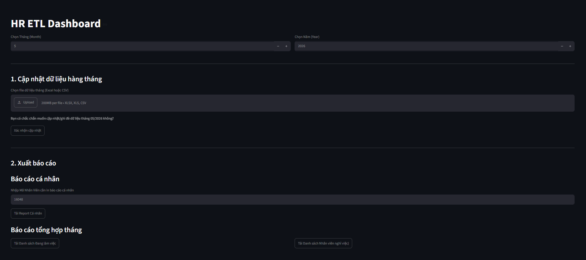

# Social Insurance Management System (SIMS)

Dự án quản lý dữ liệu bảo hiểm nhân sự, tự động hóa quy trình nạp dữ liệu và xuất báo cáo hàng tháng cho công ty.

## 📸 Ảnh minh họa

[IMAGE_PLACEHOLDER: Giao diện chính của hệ thống quản lý bảo hiểm]

## 🚀 Tính năng nổi bật
- **Nạp dữ liệu thông minh:** Tự động nhận diện cấu trúc file Excel (dòng header linh hoạt).
- **Đồng bộ hóa (Sync Engine):** Tự động xử lý dữ liệu đè (Overwrite) và kế thừa (Carry-forward) dữ liệu cũ.
- **Phân loại báo cáo:** Tự động tách biệt nhân viên làm việc, nghỉ việc và nghỉ chế độ (TS, OM, KL, ST).
- **Portable:** Có thể chạy trên máy tính không cần cài đặt Python.

## 🛠️ Hướng dẫn cài đặt & Chạy ứng dụng
1. Tải toàn bộ thư mục dự án về máy.
2. Đảm bảo máy tính có đủ quyền truy cập thư mục.
3. Click đúp vào file `CHAY_CHUONG_TRINH.bat`.
4. Hệ thống sẽ tự động mở trình duyệt tại địa chỉ `http://127.0.0.1:8000`.

## 📂 Ảnh cấu trúc thư mục
[IMAGE_PLACEHOLDER: Sơ đồ cấu trúc cây thư mục dự án]

## 📝 Quy trình xử lý dữ liệu
- File nạp vào được xử lý qua 4 bước: Đọc -> Làm sạch (Nan/Null) -> Đồng bộ DB -> Xuất báo cáo.
- Dữ liệu lỗi được log chi tiết tại terminal.

## 🤝 Liên hệ
- Người phát triển: [Tên của bạn]
- Công ty: [Tên công ty]